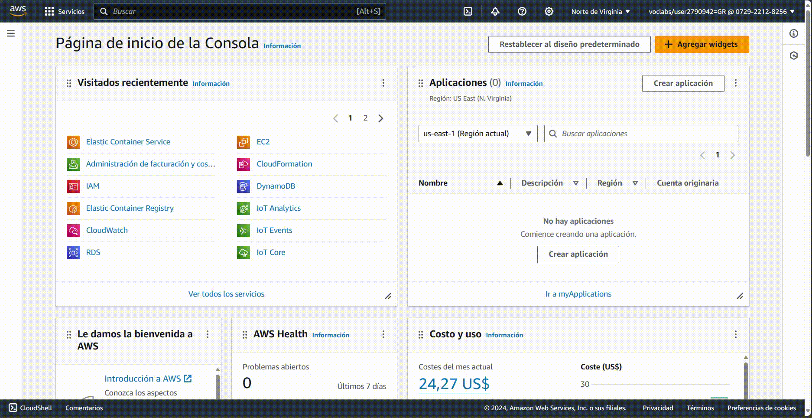
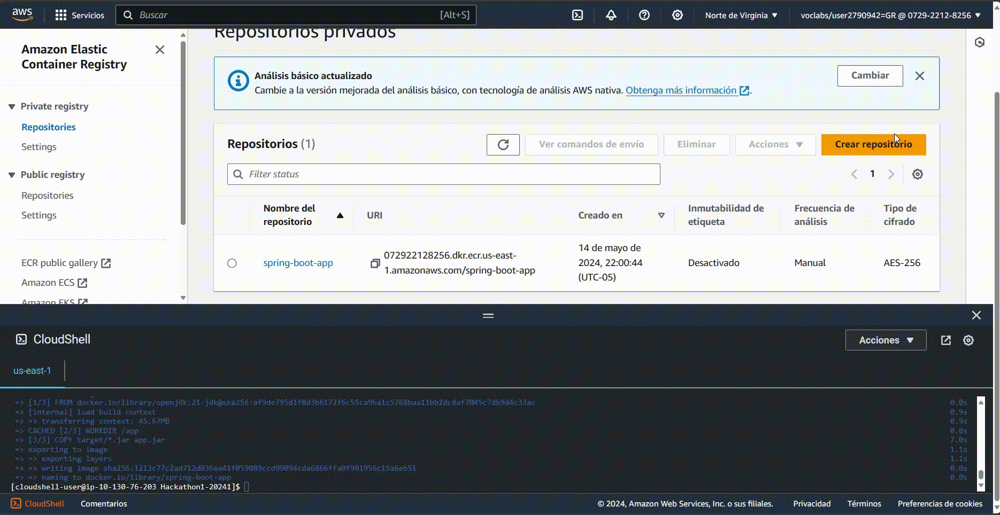
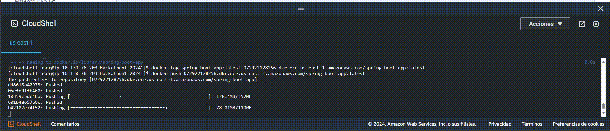
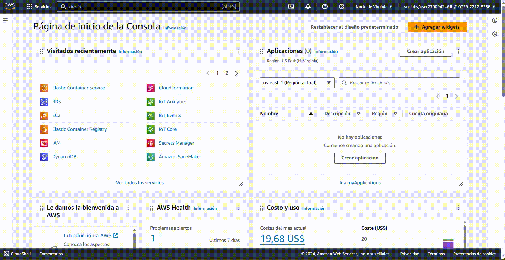

<div align="center">
  
</div>

<div align="center">
  <h1><b>Diseño de Software</b></h1>
  <h2>Manual del sistema</h2>
  <p><b>Profesor:</b> Jaime Farfán</p>
  <p><b>Alumno(s):</b></p>
  <p>Muñoz Paucar, Fernando Jose</p>
  <p>Ramírez Encinas, Oscar Gabriel</p>
  <p>Tinco Aliaga, César</p>
  <p><b>Fecha:</b> 06/12/2024</p>
  <p><b>Ciclo:</b> 2024-2</p>
</div>

---

## **Índice**
1. [Introducción](#1-introducción)
2. [Requisitos del Sistema](#2-requisitos-del-sistema)
3. [Diagrama de Arquitectura del Sistema](#3-diagrama-de-arquitectura-del-sistema)
4. [Instalación](#4-instalación)
5. [Despliegue con los servicios de AWS](#5-despliegue-con-los-servicios-de-AWS)
6. [Interfaz de Usuario](#6-interfaz-de-usuario)
7. [Funcionalidades del Sistema](#7-funcionalidades-del-sistema)
8. [Mantenimiento](#8-mantenimiento)
9. [Seguridad](#9-seguridad)
10. [Glosario](#10-glosario)
11. [Política de Privacidad y Uso](#11-política-de-privacidad-y-uso)
12. [Soporte Técnico](#12-soporte-técnico)

---

## **1. Introducción**

### **Descripción del Sistema**
**Lost&Found** es una aplicación diseñada para que los estudiantes puedan reportar incidentes y objetos perdidos de manera rápida y eficiente. La plataforma centraliza la información de los reportes, permitiendo a los administradores dar seguimiento y coordinar la devolución de objetos encontrados. Los usuarios pueden detallar características del objeto o incidente, recibir notificaciones sobre el estado de su reporte y acceder a una base de datos organizada. Esto facilita la recuperación de pertenencias y mejora la eficiencia en la gestión de incidentes dentro de la institución.

### **Propósito y Objetivos**
1. **Centralización de Reportes:** Recopilar y organizar todos los reportes de incidentes y objetos perdidos en una plataforma única, facilitando su gestión y seguimiento.
2. **Eficiencia en la Recuperación:** Reducir el tiempo y esfuerzo necesario para devolver objetos encontrados a sus propietarios mediante un sistema claro y accesible.
3. **Accesibilidad para los Estudiantes:** Ofrecer una herramienta digital intuitiva y de fácil uso para que los estudiantes puedan registrar y consultar reportes en tiempo real.
4. **Mejora de la Comunicación:** Optimizar la interacción entre estudiantes y administradores, proporcionando actualizaciones y notificaciones sobre el estado de los reportes.
5. **Fomento de la Organización:** Crear un entorno más ordenado y confiable dentro de la institución al minimizar la pérdida de objetos y promover la responsabilidad compartida.

### **Alcance**
1. **Incluye:**
   - Registro de reportes: Permite a los estudiantes ingresar información sobre incidentes y objetos perdidos, como descripción, lugar y fecha.
   - Base de datos centralizada: Organiza los reportes para facilitar la búsqueda y el seguimiento por parte de los administradores.
   - Notificaciones y actualizaciones: Envía información a los estudiantes sobre el estado de sus reportes y objetos encontrados.
   - Coordinación de entregas: Facilita la logística para devolver objetos encontrados a sus propietarios legítimos.
   - Interfaz accesible: Brinda una plataforma intuitiva para su uso tanto por estudiantes como por administradores.
2. **No incluye:**
   - Seguimiento físico de objetos: No realiza rastreo en tiempo real de los objetos extraviados fuera del sistema.
   - Resolución automática: No garantiza la recuperación de todos los objetos reportados, ya que depende de que sean encontrados y entregados.
   - Soporte fuera de la institución: Solo cubre incidentes y objetos perdidos dentro de las instalaciones o áreas definidas por la institución.
   - Gestión de objetos de terceros: No se responsabiliza por objetos que no sean propiedad de estudiantes, como los pertenecientes a visitantes o personal externo.

---

## **2. Requisitos del Sistema**

### **Hardware**
- **Servidor Backend**:
  - Procesador: Intel i5 o superior.
  - RAM: 16 GB.
  - Almacenamiento: 100 GB SSD.
  - Conexión estable a internet con al menos 100 Mbps de velocidad de carga/descarga.
- **Dispositivos Cliente**:
  - Navegador moderno (Chrome, Firefox, Edge) en PC, laptop o smartphone.

### **Software**
- **Backend**: Java 11+, Spring Boot.
- **Frontend**: React.js, Node.js 14+.
- **Base de Datos**: PostgreSQL.
- **Herramientas Adicionales**: Docker Desktop, Git y GitHub, Visual Studio Code.
- **IDE Utilizado**: IntelliJ IDEA (para el desarrollo del backend con el framework Spring Boot).

---


## **3. Diagrama de Arquitectura del Sistema**

El sistema **Lost&Found** está compuesto por los siguientes elementos principales, organizados bajo el enfoque de **arquitectura hexagonal**:

### **Componentes Principales**
- **Frontend:**
  - Una interfaz web desarrollada en **React.js** que permite a los usuarios interactuar con el sistema mediante operaciones como registrar reportes y consultar el estado de objetos perdidos.
  - Se comunica con el backend a través de API REST utilizando adaptadores de entrada.

- **Backend:**
  - Un servicio desarrollado en **Spring Boot**, organizado en torno a un **núcleo de lógica de negocio**, que implementa las reglas y procesos principales del sistema.
  - Utiliza puertos para interactuar con adaptadores de entrada (controladores REST) y salida (repositorios y servicios externos).
  
- **Base de Datos:**
  - **PostgreSQL**, que almacena información estructurada sobre:
    - Usuarios.
    - Reportes de objetos perdidos.
    - Reportes de incidentes.
    - Historial de cada usuario (estudiante o empleado).

- **Adaptadores de Entrada:**
  - **Controladores REST:** Permiten recibir las solicitudes de los usuarios desde el frontend.

- **Adaptadores de Salida:**
  - **Repositorio de datos:** Interfaz para interactuar con la base de datos PostgreSQL.
  - **Servicio de notificaciones:** Conecta el backend con herramientas externas como correos electrónicos para enviar notificaciones sobre los reportes.

### **Arquitectura Hexagonal**

El sistema sigue el diseño de **arquitectura hexagonal**, organizándose en tres capas principales:

1. **Núcleo de Lógica de Negocio:**
   - Encargado de las operaciones principales, como la validación de reportes y la gestión de usuarios.
   - Es independiente de las tecnologías externas, asegurando que pueda ser probado fácilmente sin necesidad de bases de datos o interfaces externas.

2. **Puertos (Interfaces):**
   - **Puertos de Entrada:** Interfaz para aceptar comandos del frontend (por ejemplo, crear reportes o consultar estados).
   - **Puertos de Salida:** Interfaz para comunicarse con servicios externos, como la base de datos y las notificaciones.

3. **Adaptadores:**
   - **Adaptadores de Entrada:** Controladores REST que implementan los puertos de entrada y traducen solicitudes HTTP en comandos para el núcleo.
   - **Adaptadores de Salida:** Implementaciones específicas de los puertos de salida, como repositorios para interactuar con PostgreSQL o servicios de correo.
   

### **Diagrama de Arquitectura**


### **Descripción del Flujo**
1. El usuario interactúa con el **frontend**, realizando operaciones como registrar reportes.
2. El **frontend** envía solicitudes al **backend** a través de API REST.
3. Los **adaptadores de entrada** traducen estas solicitudes en comandos para el núcleo del sistema.
4. El **núcleo de lógica de negocio** procesa las solicitudes, verificando las reglas de negocio (por ejemplo, validar si el correo del usuario ya está registrado).
5. Si es necesario, el núcleo interactúa con los **adaptadores de salida**, que se encargan de consultar o actualizar datos en la base de datos, o enviar notificaciones a través de servicios externos.
6. Las respuestas se envían de vuelta al **frontend** para mostrarlas al usuario.

### **Beneficios del Enfoque Hexagonal**
- **Desacoplamiento:**
  - La lógica de negocio está completamente aislada de los detalles tecnológicos, como bases de datos o frameworks.
- **Flexibilidad:**
  - Cambiar el servicio de base de datos o proveedor de correos no afecta al núcleo del sistema.
- **Facilidad de prueba:**
  - El núcleo puede ser probado de manera independiente, sin necesidad de configurar bases de datos o servicios externos.
- **Escalabilidad:**
  - Es fácil extender el sistema añadiendo nuevos adaptadores o integraciones sin modificar la lógica central.

Este diseño permite a **Lost&Found** ser un sistema robusto, flexible y preparado para escalar a medida que crecen las necesidades de la aplicación.

---

## **4. Instalación**

### **Pasos de Instalación**

1. **Clonar el repositorio**:
   ```bash
   git clone https://github.com/FMunoz99/ProyectoDS.git
   ```

2. **Ejecutar el backend**:
   - Abre el proyecto en IntelliJ IDEA.
      ```bash
      idea .\backend\
      ```
   - Abre el terminal y ejecutar el comando:
     <br>
     ```bash
     docker run --name dsLostAndFound -e POSTGRES_PASSWORD=postgres -p 5555:5432 -d postgres
     ```
     
   - Abrir Docker Desktop y ejecutar el nuevo contenedor creado
     
     
   - Crear un archivo `.env.local` al mismo nivel del directorio /src
     <br>
     
     
   - Abrir el editor de configuraciones  
     
     
   - Ejecutar la modificación de opciones `Alt + M`  
     
     
   - Seleccionar `Environment variables` y `Shorten command line`  
     
     
   - Para las variables de entorno, ingresar la ruta del archivo dentro del directorio y para las líneas de comando, seleccionar la opción JAR
     
     
   - Configurar el archivo `application.properties` (/src/main/resources/) seleccionando el ícono de base de datos que aparece en la línea 4 para conectar la base de datos PostgreSQL.
     
     
   - Ingresar la contraseña `postgres` para verificar la conexión a la base de datos.
     
     
   - Iniciar el servidor con `Shift + F10`.

3. **Instalar dependencias del frontend**:
   - Iniciar Visual Studio Code
   - Abrir el terminal y ejecutar los siguientes comandos:
   ```bash
   cd Frontend
   npm install
   ```

5. **Ejecutar el frontend**:
   ```bash
   npm run dev
   ```
   Accede a la aplicación en [http://localhost:5173/](http://localhost:5173/).

---

## **5. Despliegue con los servicios de AWS**

En esta sección se detalla cómo desplegar el sistema **Lost&Found** utilizando diversos servicios de AWS, asegurando una integración eficiente y escalable. Este despliegue comprende tanto el backend como el frontend, utilizando herramientas como ECS, RDS, ECR, EC2, S3 y Amplify.

### **5.1. Despliegue del Backend**

El backend del sistema se despliega utilizando los siguientes servicios de AWS:
- **Amazon ECS (Elastic Container Service):** Gestiona los contenedores Docker que ejecutan la aplicación.
- **Amazon ECR (Elastic Container Registry):** Almacena las imágenes Docker.
- **Amazon RDS (Relational Database Service):** Proporciona la base de datos PostgreSQL para el sistema.
- **Amazon EC2 (Elastic Compute Cloud):** Proporciona la infraestructura subyacente para los servicios de ECS.
- **Amazon S3 (Simple Storage Service):** Almacena archivos como fotos de perfil y reportes de usuarios.

### Paso 1: Añadir Dockerfile al Proyecto de Spring Boot con Java 21

Primero, crearemos un archivo `Dockerfile` para nuestro proyecto de Spring Boot:

```Dockerfile
FROM openjdk:21-jdk
WORKDIR /app
COPY target/*.jar /app/app.jar
EXPOSE 8080
ENTRYPOINT ["java", "-jar", "app.jar"]
```

#### Construcción del Proyecto

A continuación, necesitamos construir el proyecto de Spring Boot para generar el archivo JAR. Ejecutamos el siguiente comando en la terminal de IntelliJ IDEA o en la terminal de tu sistema operativo:

```bash
mvn clean package
```

Este comando compilará el proyecto y generará el archivo JAR en la carpeta `target`. Cuando commitiemos el proyecto, asegúrate de que el archivo JAR se haya generado correctamente y esté en la carpeta `target`. 

```
target
├── classes
├── generated-sources
├── generated-test-sources
├── maven-archiver
├── maven-status
├── surefire-reports
├── test-classes
├── backend-0.0.1-SNAPSHOT.jar
└── backend-0.0.1-SNAPSHOT.jar.original
```

### Paso 2: Abrir la Cloud Shell de AWS

Para desplegar nuestra aplicación en ECS, necesitamos acceder a la consola de AWS. Podemos hacerlo a través de la Cloud Shell de AWS, que nos permite ejecutar comandos de AWS directamente en el navegador.



Vamos a crear una carpeta llamada `app` en la Cloud Shell y subir nuestro archivo `backend-0.0.1-SNAPSHOT.jar` junto con el `Dockerfile` a esta carpeta.

Para subir los archivos, le damos click a "Acciones" y seleccionamos "Subir archivo" y seleccionamos los archivos `backend-0.0.1-SNAPSHOT.jar` y `Dockerfile`.

Creamos la carpeta `app` y movemos los archivos a esta carpeta:

```bash
mkdir app
mv backend-0.0.1-SNAPSHOT.jar app
mv Dockerfile app
```

Ahora desde app crearemos `target` y moveremos el archivo `backend-0.0.1-SNAPSHOT.jar` a esta carpeta:

```bash
mkdir target
mv backend-0.0.1-SNAPSHOT.jar target
```

La estructura de archivos debería verse así:

```
app
├── Dockerfile
├── target
│   └── backend-0.0.1-SNAPSHOT.jar
```

### Paso 3: Crear un Repositorio en ECR

Amazon ECR (Elastic Container Registry) es el servicio equivalente de AWS a Docker Hub, permitiéndonos almacenar, administrar y desplegar nuestras imágenes de contenedores de manera eficiente.

1. **Abrir la Consola de AWS**: Navega a la consola de AWS.
2. **Buscar ECR**: Usa la barra de búsqueda en la parte superior para encontrar el servicio ECR.
3. **Crear Repositorio**: Una vez en la página de ECR, sigue las instrucciones para crear un nuevo repositorio y dale el nombre que prefieras.


### Paso 4: Construir y Subir la Imagen al Repositorio de ECR

1. **Autenticar Docker con ECR**: Primero, necesitamos autenticar Docker con nuestro repositorio de ECR. Copiamos el URI del repositorio de ECR que acabamos de crear y ejecutamos el siguiente comando desde la Cloud Shell de AWS:

```bash
aws ecr get-login-password --region us-east-1 | docker login --username AWS --password-stdin <account_id>.dkr.ecr.us-east-1.amazonaws.com
```

Para extraer nuestro `account_id`, dirígete a la esquina superior derecha al costado de la región y haz clic. Esto abrirá una interfaz donde podemos copiar el ID de la cuenta:



Si la autenticación es exitosa, veremos un mensaje de éxito similar a este:

```bash
WARNING! Your password will be stored unencrypted in /home/cloudshell-user/.docker/config.json.
Configure a credential helper to remove this warning. See
https://docs.docker.com/engine/reference/commandline/login/#credentials-store

Login Succeeded
```

2. **Construir la Imagen de Docker**: Ahora, construimos la imagen de Docker para nuestra aplicación de Spring Boot. En la terminal, ejecuta:

```bash
docker build -t dsoftware-app .
```

3. **Etiquetar la Imagen**: Necesitamos etiquetar nuestra imagen de Docker con el URI de nuestro repositorio de ECR. 

```bash
docker tag dsoftware-app:latest <account_id>.dkr.ecr.us-east-1.amazonaws.com/dsoftware-app:latest
```

4. **Subir la Imagen a ECR**: Finalmente, subimos la imagen etiquetada a nuestro repositorio de ECR:

```bash
docker push <account_id>.dkr.ecr.us-east-1.amazonaws.com/dsoftware-app:latest
```



Nuestra imagen de Docker se ha subido al repositorio de ECR. Podemos verificarlo en la consola de AWS o directamente en la consola de ECR.

### Paso 5: Crear Grupos de Seguridad para ECS y RDS

Para permitir que ECS se comunique con RDS, necesitamos crear un grupo de seguridad para cada uno. Sigamos estos pasos:

1. **Crear Grupo de Seguridad para ECS (sg_ecs)**:
   - **Nombre del Grupo**: sg_ecs
   - **Puertos**: Abrir el puerto 8080 para Spring Boot
   - **Fuente**: Todos los orígenes (0.0.0.0/0)
   - **Egreso**: Permitir todo el tráfico (0.0.0.0/0)

   Esto permitirá que nuestra aplicación Spring Boot reciba tráfico en el puerto 8080.

2. **Crear Grupo de Seguridad para RDS (sg_rds)**:
   - **Nombre del Grupo**: sg_rds
   - **Puertos**: Abrir el puerto 5432 para Postgres
   - **Fuente**: Limitar la entrada únicamente desde el grupo de seguridad sg_ecs
   - **Salida**: Sin reglas de salida (ya que RDS no necesita enviar tráfico saliente)

   Esto asegurará que nuestra base de datos Postgres solo acepte conexiones desde nuestra aplicación ECS.

Ahora nuestros servicios podrán comunicarse de forma segura y eficiente.

### Paso 6: Crear la Base de Datos en RDS

Para almacenar nuestros datos, vamos a crear una base de datos en Amazon RDS usando el motor PostgreSQL. Sigamos estos pasos para asegurarnos de tener todo correctamente configurado:

1. **Buscar el Servicio RDS**:
   - En la barra de búsqueda, escribimos "RDS" y seleccionamos el servicio Amazon RDS.

2. **Crear una Nueva Instancia de Base de Datos**:
   - Hacemos clic en "Crear base de datos" y seleccionamos el motor **PostgreSQL**.
3. **Configuración Manual**:
   - Seleccionamos la opción de configuración **manual** para tener control total sobre la configuración.
   - Establecemos una **contraseña** segura para el usuario administrador (master user).

4. **Configurar Parámetros Básicos**:
   - Elegimos una clase de instancia y configuramos las opciones de almacenamiento según nuestras necesidades.
   - Por defecto, se creará una URL de la base de datos y una base de datos llamada `postgres`.

5. **Configurar la Conectividad**:
   - Seleccionamos el grupo de seguridad que creamos anteriormente para RDS (`sg_rds`), asegurándonos de que permita conexiones solo desde el grupo de seguridad de ECS (`sg_ecs`).

6. **Crear y Guardar las Credenciales**:
   - Al finalizar la configuración, copiamos las credenciales de la base de datos (nombre de usuario, contraseña, URL) y las guardamos en un lugar seguro.
   - Estas credenciales serán necesarias para configurar nuestra aplicación Spring Boot para conectarse a la base de datos.

Ahora tenemos una base de datos PostgreSQL en Amazon RDS lista para ser utilizada por nuestra aplicación.

### Paso 7: Crear un Cluster de ECS

Para desplegar nuestra aplicación en contenedores, necesitamos crear un cluster en Amazon ECS. Aquí están los pasos detallados:

1. **Buscar ECS**:
   - Usamos la barra de búsqueda de AWS para encontrar el servicio **ECS**.

2. **Crear Cluster**:
   - Hacemos clic en "Crear cluster" y seleccionamos el tipo de cluster que prefiramos (EC2 o Fargate). 
   - Para una gestión más sencilla y sin necesidad de administrar servidores, seleccionamos **Fargate**.

4. **Finalizar y Crear**:
   - Revisamos las configuraciones y hacemos clic en "Crear" para finalizar el proceso.



### Paso 8: Definir una tarea de ECS

En este paso, definiremos una tarea de ECS para ejecutar nuestra aplicación Spring Boot en un contenedor. Aquí están los pasos detallados:

1. **Crear una Definición de Tarea**:
   - En la página de ECS, seleccionamos "Tareas" en el menú lateral y hacemos clic en "Crear nueva tarea".
   - Asignamos un nombre a la tarea, seleccionamos el tipo de tarea y configuramos los recursos necesarios (1 vCPU, 2 GB de RAM).
   - Para el rol de la tarea y el rol de ejecución, seleccionamos `LabRole`.


2. **Definir el Contenedor**:
   - En la sección de contenedores, asignamos un nombre al contenedor y copiamos el URI de nuestra imagen de Docker en ECR. 
   - Configuramos los puertos de la aplicación, especificando el puerto 8080. 
   - En la sección de límites de recursos, asignamos 1 vCPU y 2 GB de RAM en el límite estricto de memoria y 1 GB en el límite flexible de memoria.
   - Asignamos las variables de entorno necesarias para la base de datos (URL, usuario, contraseña) para que nuestra aplicación Spring Boot pueda conectarse a la base de datos.

   Cargamos las variables de entorno copiando las credenciales de la base de datos en el contenedor, las cuales se generaron en RDS. Usaremos:
   - `DB_HOST`: la URL de la base de datos.
   - `DB_PORT`: el puerto de la base de datos.
   - `DB_NAME`: el nombre de la base de datos, por defecto `postgres`.
   - `DB_USERNAME`: el nombre de usuario.
   - `DB_PASSWORD`: la contraseña.
   - `JWT_SIGNING_KEY`: la contraseña del servicio Spring Security
   - `EMAIL`: el correo electrónico que enviará los emails
   - `EMAIL_PASSWORD`: la contraseña de aplicación del correo
   - `AWS_ACCESS_KEY`: la llave de acceso de AWS
   - `AWS_SECRET_KEY`: la llave secreta de acceso de AWS
   - `AWS_SESSION_TOKEN`: el token de sesión de AWS
   - `AWS_REGION`: la región en la que trabajas con los servicios de AWS
   - `AWS_BUCKET_NAME`: el nombre único del bucket

   - Apagamos el servicio de Cloudwatch, está como una opción de casilla `Utilizar la recopilación de registros`
   - En volumen de almacenamiento, asignamos un volumen de almacenamiento de 21 GB para almacenar los datos de la aplicación.

3. **Finalizar y Crear**:
   - Revisamos la configuración de la tarea y hacemos clic en "Crear" para finalizar el proceso.

   

### Paso 9: Crear un Servicio de ECS

Ahora nos toca crear un servicio de ECS para ejecutar nuestra tarea en el cluster. Aquí están los pasos detallados:

1. **Crear un Servicio**:
   - En la página de ECS, dirigimos a nuestro cluster y hacemos clic en "Crear nuevo servicio".

2. **Configurar el Servicio**:
   - Asignamos un nombre al servicio y seleccionamos la definición de tarea que creamos anteriormente.
   - En redes, seleccionamos los grupos de subredes y el grupo de seguridad que creamos anteriormente para ECS (`sg_ecs`).

3. **Crear y Desplegar**:
   - Revisamos la configuración del servicio y hacemos clic en "Crear" para finalizar el proceso.

Demora unos minutos en desplegar el servicio. Una vez completado, podremos ver nuestra aplicación Spring Boot ejecutándose en un contenedor en ECS.

### Paso 10: Acceder a la Aplicación en ECS

La tarea tiene una dirección IP publica que podemos usar para acceder a nuestra aplicación Spring Boot. 

Nos conectamos a la dirección IP pública de la tarea en el puerto 8080 para acceder a nuestra aplicación.

¡Y eso es todo! Hemos desplegado nuestra aplicación Spring Boot en un contenedor en Amazon ECS.

### **5.2. Despliegue del Frontend**

El frontend se despliega utilizando **AWS Amplify**, que simplifica la configuración y el mantenimiento de aplicaciones web.


### **5.3. Almacenamiento de Archivos en S3**

#### 5.3.1. Creación de un Bucket S3

1. Acceder a la Consola de AWS:
   - Primero, inicia sesión en tu cuenta de AWS y navega hasta el servicio S3 desde el panel principal.
   - Haz clic en "Create bucket" para iniciar el proceso de creación.

2. Nombre del Bucket:
   - Asigna un nombre único a tu bucket. Este nombre debe ser globalmente único en AWS, lo que significa que ningún otro usuario de AWS en el mundo puede tener un bucket con el mismo nombre.
   - Ejemplo: mis-archivos-proyecto-utec.

      .gif) 

3. Opciones de Configuración: 
   - Dejar las configuraciones por defecto y hacer clic en "Create bucket".

4. Obtener las credenciales de acceso:
   - Para interactuar con S3 desde nuestra aplicación, necesitamos obtener las credenciales de acceso. Estas credenciales consisten en un Access Key ID y un Secret Access Key que se utilizan para autenticar las solicitudes a S3. Además es necesario un session token que cambia cada cierto tiempo. Todas estas credenciales se pueden obtener en la sección AWS Details de la consola de AWS academy
      
      

###  ¿Cómo Funciona la Gestión de Fotos de Perfil con S3 y Spring Boot?

Una vez hayas obtenido las credenciales en tu sesión de AWS Academy, puedes empezar a implementar el backend del demo. En este demo, hemos implementado una API en Spring Boot que permite a los usuarios cargar, obtener y eliminar su foto de perfil, almacenándola de manera segura en Amazon S3. A continuación, te explico paso a paso cómo funciona cada parte del código, desde la subida de archivos hasta la generación de URLs pre-firmadas para acceder a las fotos de perfil. 

#### 1. Configuración de S3 en Spring Boot

Primero, configuramos la conexión a S3 en nuestra aplicación utilizando las credenciales de AWS y la región correspondiente. Esto se hace en la clase `StorageConfig`:

```java
@Configuration
public class StorageConfig {
    @Value("${cloud.aws.credentials.accessKey}")
    private String accessKey;

    @Value("${cloud.aws.credentials.secretKey}")
    private String secretKey;

    @Value("${cloud.aws.credentials.sessionToken}")
    private String accesSessionToken;

    @Value("${cloud.aws.region.static}")
    private String region;

    @Bean
    public AmazonS3 getAmazonS3Client() {
        final var basicSessionCredentials = new BasicSessionCredentials(accessKey, secretKey, accesSessionToken);

        return AmazonS3ClientBuilder
                .standard()
                .withRegion(String.valueOf(RegionUtils.getRegion(region)))
                .withCredentials(new AWSStaticCredentialsProvider(basicSessionCredentials))
                .build();
    }
}
```

En este fragmento de código:
- **Credenciales Seguras**: Las credenciales de AWS (`accessKey`, `secretKey`, `sessionToken`) se inyectan desde el archivo `application.properties`, manteniéndolas seguras y fáciles de modificar.
- **Cliente de S3**: Creamos un `AmazonS3` que es utilizado para interactuar con el servicio de almacenamiento S3.

#### 2. Subiendo una Foto de Perfil

El siguiente paso es permitir que los usuarios suban su foto de perfil. Esto se maneja en el controlador `MediaController`:

```java
@PostMapping("/profile-pic")
public ResponseEntity<?> uploadProfilePic(@RequestBody MultipartFile file, Principal principal) throws Exception {
    String username = principal.getName();

    String objectKey = "profile-pics/" + username;
    String fileKey = storageService.uploadFile(file, objectKey);

    UserAccount user = userService.findByEmail(username);
    user.setProfilePictureKey(fileKey);
    userService.save(user);

    return ResponseEntity.ok("Profile picture uploaded successfully");
}
```

**Explicación:**
- **Seguridad**: Utilizamos `Principal` para obtener el nombre del usuario autenticado. Esto asegura que cada usuario solo pueda modificar su propia foto de perfil.
- **Key Unica en S3**: El `objectKey` para almacenar el archivo en S3 se basa en el nombre de usuario, asegurando que cada usuario tenga su propio espacio en S3.
- **Almacenamiento Seguro**: La foto se sube a S3 a través del `StorageService`. El key del objeto se guarda en la base de datos para referencia futura.

#### 3. Servicio de Almacenamiento: Subida de Archivos a S3

El servicio `StorageService` maneja la interacción directa con S3, incluyendo la subida de archivos:

```java
public String uploadFile(MultipartFile file, String objectKey) throws Exception {
    if (file.isEmpty() || file.getSize() > 5242880)
        throw new IllegalArgumentException("Invalid file size");

    if (objectKey.startsWith("/") || !objectKey.contains("."))
        throw new IllegalArgumentException("Invalid object key");

    ObjectMetadata metadata = new ObjectMetadata();
    metadata.setContentType(file.getContentType());
    metadata.setContentLength(file.getSize());

    if (s3Client.doesObjectExist(bucketName, objectKey))
        deleteFile(objectKey);

    try (InputStream inputStream = file.getInputStream()) {
        s3Client.putObject(new PutObjectRequest(bucketName, objectKey, inputStream, metadata));
        return objectKey;
    } catch (IOException e) {
        throw new Exception("Failed to upload file to S3", e);
    }
}
```

**Puntos Clave:**
- **Validación de Archivos**: Se valida el tamaño del archivo y el formato del `objectKey` antes de proceder, evitando errores y asegurando que los archivos subidos cumplan con los requisitos.
- **Metadata del Archivo**: Se añaden metadatos como el tipo de contenido y la longitud del archivo, lo que es importante para un manejo correcto en S3.
- **Eliminación de Archivos Duplicados**: Si ya existe un archivo con el mismo `objectKey`, se elimina antes de subir el nuevo archivo, asegurando que no haya conflictos.

#### 4. Generación de una URL Pre-firmada

#####  ¿Qué es una URL Pre-firmada (Presigned URL)?

Una **URL pre-firmada** (Presigned URL) es una URL que proporciona acceso temporal y seguro a un objeto almacenado en Amazon S3, sin necesidad de que el usuario tenga credenciales directas de AWS. La URL pre-firmada está "firmada" con credenciales de AWS y tiene una duración limitada, después de la cual expira y deja de ser válida.

##### ¿Cómo funciona una Presigned URL?

Cuando generas una URL pre-firmada:

1. **Se firma la URL** con tus credenciales de AWS, lo que asegura que solo quienes tengan la URL puedan acceder al archivo.
2. **Se especifica un tiempo de expiración**: Definir el tiempo de validez garantiza que el acceso sea temporal, aumentando la seguridad.
3. **Se establece el permiso**: Puedes definir si la URL permite operaciones de lectura, escritura o ambas.

Por ejemplo, en el contexto de una aplicación web donde los usuarios pueden subir y ver fotos de perfil, una URL pre-firmada te permite:

- **Subir una imagen** de forma directa y segura al bucket S3.
- **Obtener la URL temporal** para que el usuario pueda visualizar su imagen de perfil sin exponer el archivo públicamente.

Ahora para obtener la foto de perfil, generamos una URL pre-firmada que permite el acceso temporal al archivo almacenado en S3:

```java
@GetMapping("/profile-pic")
public ResponseEntity<String> getProfilePic(Principal principal) {
    UserAccount user = userService.findByEmail(principal.getName());

    if (user.getProfilePictureKey() == null)
        return ResponseEntity.notFound().build();

    String presignedUrl = storageService.generatePresignedUrl(user.getProfilePictureKey());
    return ResponseEntity.ok(presignedUrl);
}
```

```java
public String generatePresignedUrl(String objectKey) {
    if (!s3Client.doesObjectExist(bucketName, objectKey))
        throw new RuntimeException("File not found in S3");

    Date expiration = new Date(System.currentTimeMillis() + 1000 * 60 * 60 * 2);
    GeneratePresignedUrlRequest generatePresignedUrlRequest =
            new GeneratePresignedUrlRequest(bucketName, objectKey)
                    .withExpiration(expiration);

    URL url = s3Client.generatePresignedUrl(generatePresignedUrlRequest);
    return url.toString();
}
```

**Detalles Importantes:**
- **Acceso Seguro**: Las URLs pre-firmadas permiten que solo usuarios autenticados puedan acceder a sus fotos de perfil. La URL es válida solo por un tiempo limitado (en este caso, 2 horas).
- **Generación Dinámica**: La URL se genera al momento de la solicitud, lo que añade una capa adicional de seguridad.

## Envio de Archivos a S3 desde React

Nuestra API ya es capaz de procesar y almacenar archivos en S3. Ahora, necesitamos una forma de enviar archivos desde el frontend. En este caso, utilizaremos React (typescript) para construir un formulario de carga de archivos y enviarlos a nuestro backend.

### 1. Creación de un Formulario de Carga de Archivos

Primero, creamos un formulario simple en React que permite a los usuarios seleccionar y cargar un archivo. Pero primero debes de saber que es un form-data.

## ¿Qué es FormData y para qué se utiliza en el Frontend?

**FormData** es una interfaz proporcionada por JavaScript que te permite construir un conjunto de pares clave/valor, representando campos de un formulario, que pueden ser enviados fácilmente utilizando métodos como `fetch` o `XMLHttpRequest`. Este objeto es particularmente útil cuando necesitas subir archivos junto con otros datos a un servidor.

### ¿Para qué sirve FormData?

FormData es extremadamente útil en aplicaciones web donde los usuarios interactúan con formularios que contienen campos de texto y archivos. Algunas situaciones comunes donde se utiliza FormData son:

1. **Subida de archivos**: Facilita la transmisión de archivos (como imágenes, documentos, etc.) desde el navegador al servidor, permitiendo al usuario adjuntar archivos a un formulario y enviarlos con otros datos.
  
2. **Envío de datos complejos**: Cuando un formulario contiene múltiples campos de diferentes tipos (texto, selectores, casillas de verificación, etc.), FormData puede manejar todo ese contenido y enviarlo de una sola vez al servidor.

3. **Interacciones asincrónicas**: FormData es ideal para aplicaciones modernas que requieren enviar datos al servidor sin recargar la página, mejorando la experiencia del usuario.

### ¿Cómo funciona FormData?

El uso de FormData en el frontend es sencillo y se hace en tres pasos principales:

1. **Creación del objeto FormData**: Puedes crear un objeto FormData vacío o inicializarlo con un formulario HTML existente.
   
   ```javascript
   const formData = new FormData(); // Objeto vacío
   // O inicializar con un formulario HTML
   const formData = new FormData(document.querySelector('form'));
   ```

2. **Añadir campos y archivos**: Puedes agregar datos al objeto FormData usando el método `.append()`. Este método permite agregar tanto campos de texto como archivos.

   ```javascript
   formData.append('username', 'john_doe');
   formData.append('profilePic', fileInput.files[0]); // 'fileInput' es un <input type="file">
   ```

3. **Enviar el FormData al servidor**: Finalmente, el objeto FormData se envía al servidor utilizando `fetch` o `XMLHttpRequest`.

   ```javascript
   fetch('/upload', {
       method: 'POST',
       body: formData,
   })
   .then(response => response.json())
   .then(data => console.log(data))
   .catch(error => console.error('Error:', error));
   ```

Ahora sí, con esta información en mente, podemos proceder a crear el formulario de carga de archivos en React:

```tsx
import React, { useState } from 'react';
import axios from 'axios';

const FileUpload = () => {
    const [file, setFile] = useState<File | null>(null);

    const handleFileChange = (e: React.ChangeEvent<HTMLInputElement>) => {
        const selectedFile = e.target.files?.[0];
        if (selectedFile) setFile(selectedFile);
    };

    const handleUpload = async () => {
        if (!file) return;

        const formData = new FormData();
        formData.append('file', file);

        try {
            await axios.post('http://localhost:8080/api/profile-pic', formData, {
                headers: {
                    'Content-Type': 'multipart/form-data'
                }
            });
            alert('File uploaded successfully');
        } catch (error) {
            alert('Failed to upload file');
        }
    };

    return (
        <div>
            <input type="file" onChange={handleFileChange} />
            <button onClick={handleUpload}>Upload</button>
        </div>
    );
};

export default FileUpload;
```

**Explicación:**
- **Estado Local**: Utilizamos el estado local de React para almacenar el archivo seleccionado por el usuario.
- **Manejo de Eventos**: Los eventos `onChange` y `onClick` se utilizan para capturar la selección del archivo y la carga del archivo, respectivamente.
- **Envío de Archivos**: Al hacer clic en el botón "Upload", el archivo se envía al backend a través de una solicitud POST.
- **Manejo de Errores**: Se muestra una alerta en caso de que la carga del archivo falle.
- **Nota**: Asegúrate de que la URL de la API en `axios.post` coincida con la URL de tu backend.

### 2. Visualización de la Foto de Perfil

Finalmente, necesitamos una forma de mostrar la foto de perfil del usuario. Para ello, generamos una URL pre-firmada en el frontend y la utilizamos para cargar la imagen:

```tsx
import React, { useEffect, useState } from 'react';
import axios from 'axios';

const ProfilePic = () => {
    const [profilePicUrl, setProfilePicUrl] = useState<string | null>(null);

    useEffect(() => {
        const fetchProfilePic = async () => {
            try {
                const response = await axios.get('http://localhost:8080/api/profile-pic');
                setProfilePicUrl(response.data);
            } catch (error) {
                console.error('Failed to fetch profile picture');
            }
        };

        fetchProfilePic();
    }, []);

    return (
        <div>
            {profilePicUrl ? (
                
            ) : (
                <p>No profile picture found</p>
            )}
        </div>
    );
};

export default ProfilePic;
```

**Explicación:**
- **Efecto de Lado del Cliente**: Utilizamos un efecto de lado del cliente para cargar la foto de perfil del usuario al renderizar el componente.
- **Solicitud GET**: Realizamos una solicitud GET a la API para obtener la URL pre-firmada de la foto de perfil.
- **Visualización de la Imagen**: Si la URL es válida, mostramos la imagen en el componente. De lo contrario, mostramos un mensaje de error.

---

## **6. Interfaz de Usuario**

### **Pantallas del Sistema**
- **Página de Bienvenida:** Permite a los usuarios iniciar sesión o registrarse en la plataforma.
- **Página Principal:** Muestra una lista de objetos reportados como perdidos y encontrados, además de opciones para crear nuevos reportes.
- **Detalles del Reporte:** Presenta información detallada sobre un objeto perdido o encontrado.
- **Panel de Empleado:** Herramientas de control y visualización de reportes para la actualización del estado de los reportes.
- **Panel de Administración:** Herramientas como un dashboard para monitorear la cantidad de reportes por día que se realizan.

### **Interacción**
- **Botones:** Crear reporte, marcar como `FINALIZADO`, notificar al propietario mediante correos electrónicos.
- **Formularios:** Registro de incidentes y descripción de objetos.
- **Menús:** Navegación entre reportes, usuarios y configuraciones.

---

## **7. Funcionalidades del Sistema**

1. **Registro de Reportes:**
   - Los estudiantes pueden crear reportes con detalles del objeto perdido, como descripción, lugar y fecha del incidente.

2. **Gestión de Reportes:**
   - Los administradores pueden filtrar y organizar los reportes en categorías (reportes `ACEPTADOS`, `NO ACEPTADOS`, `FINALIZADOS` y `NO FINALIZADOS`).

3. **Notificaciones:**
   - Los usuarios reciben actualizaciones por correo sobre el estado de su reporte.

4. **Coordinación de Devoluciones:**
   - Se agenda la devolución de un objeto perdido mediante los datos de contacto que brinda el estudiante al momento de rellenar el formulario.

---

## **8. Mantenimiento**

1. **Actualizaciones:**
   - Mantener las dependencias actualizadas regularmente.
   - Revisar la seguridad del sistema.

2. **Respaldo de Datos:**
   - Implementar respaldos automáticos para la base de datos.

3. **Resolución de Problemas:**
   - Revisar logs del sistema para detectar errores en tiempo de ejecución.

---


## **9. Seguridad**

1. **Autenticación y Autorización:**
   - Uso de **Spring Security** como framework principal para la gestión de autenticación y autorización.
   - **JSON Web Tokens (JWT):**
      - Se utilizan para garantizar sesiones seguras.
      - El token incluye información codificada sobre el usuario, como su rol, y es firmado con HMAC 256 para garantizar su integridad.
   - **Roles específicos:**
      - **Administrador:** Acceso completo al sistema, gestión de reportes y usuarios.
      - **Empleado:** Gestión de reportes, actualizaciones y coordinación.
      - **Estudiante:** Registro de reportes y consulta de estados.

2. **Buenas Prácticas:**
   - Uso de **contraseñas seguras**, almacenadas con algoritmos de hash.
   - Todas las conexiones entre cliente y servidor están protegidas mediante **HTTPS**.
   - Implementación de políticas de seguridad en endpoints para garantizar que solo los roles autorizados puedan acceder a los recursos específicos.

### **Uso de Spring Security**

**Spring Security** permite implementar mecanismos de seguridad de manera estructurada. Su integración incluye:

1. **Filtro de Autenticación:**
   - Valida los tokens JWT enviados por el cliente en cada solicitud.
   - Si el token es válido, extrae la información del usuario y la asigna al contexto de seguridad.
   
2. **Control de Acceso por Roles:**
   - Se define qué roles tienen permiso para acceder a los endpoints específicos.
   - Ejemplo:
     ```java
     @PreAuthorize("hasRole('ADMIN')")
     public ResponseEntity<?> manageReports() {
         return ResponseEntity.ok("Acceso permitido solo a administradores");
     }
     ```

3. **Configuración Centralizada:**
   - Las políticas de seguridad, como rutas públicas o protegidas, se configuran en una clase específica:
     ```java
     @Configuration
     public class SecurityConfig extends WebSecurityConfigurerAdapter {
         @Override
         protected void configure(HttpSecurity http) throws Exception {
             http
                 .csrf().disable()
                 .authorizeRequests()
                 .antMatchers("/public/**").permitAll()
                 .antMatchers("/admin/**").hasRole("ADMIN")
                 .anyRequest().authenticated()
                 .and()
                 .addFilter(new JwtAuthenticationFilter(authenticationManager()));
         }
     }
     ```

### **Diagrama de Funcionamiento**

A continuación, se presenta un diagrama que describe cómo funciona la autenticación con Spring Security y JWT:


---

### **Flujo de Trabajo de Seguridad:**
1. El usuario envía sus credenciales al endpoint de autenticación.
2. Spring Security valida las credenciales:
   - Si son correctas, se genera un JWT y se envía al cliente.
3. El cliente incluye el JWT en el encabezado de todas las solicitudes posteriores.
4. Spring Security intercepta las solicitudes:
   - Valida el JWT y extrae la información del usuario.
   - Verifica si el usuario tiene los permisos necesarios para acceder al recurso solicitado.
5. Si todo es válido, se permite el acceso; de lo contrario, se devuelve un error 403 (Forbidden).

Con esta configuración, el sistema garantiza una seguridad robusta y adaptable, protegiendo los datos y recursos del sistema **Lost&Found**.

---

## **10. Glosario**
- **Reporte:** Información detallada sobre un objeto perdido o incidente.
- **Administrador:** Usuario encargado de gestionar la base de datos de reportes.
- **Notificaciones por eventos asíncronos:** Mensajes enviados al correo del usuario para actualizar sobre el estado del reporte.

---

## **11. Política de Privacidad y Uso**

En el sistema **Lost&Found**, respetamos la privacidad de los usuarios y gestionamos los datos personales con responsabilidad. Aquí se detallan los aspectos más importantes sobre cómo protegemos y usamos la información:

### **Datos Recopilados**
- **Correo Electrónico:** Se utiliza para identificar a los usuarios y enviar notificaciones relacionadas con los reportes.
- **Contraseñas:** Se almacenan de manera segura utilizando algoritmos de hash (HMAC 256).
- **Reportes:** Información detallada sobre los objetos perdidos o encontrados, incluyendo descripciones, fechas y ubicaciones.

### **Uso de los Datos**
- Los correos electrónicos se usan para:
  - Evitar cuentas duplicadas mediante verificación.
  - Enviar actualizaciones sobre reportes.
- La información de los reportes se utiliza exclusivamente para gestionar incidentes dentro del sistema.

### **Medidas de Seguridad**
- Las contraseñas están protegidas mediante algoritmos de hash.
- Los correos electrónicos actualmente no están encriptados, pero se verifica si ya están registrados para evitar duplicados.

### **Limitaciones**
- **Responsabilidad del Usuario:** Asegúrese de no compartir sus credenciales con terceros.
- **Privacidad del Correo Electrónico:** Aunque el sistema evita registros duplicados, los correos no están encriptados. Se recomienda usar correos institucionales para mayor seguridad.

Para más información, contacte al equipo de soporte técnico.

---

## **12. Soporte Técnico**

- **Email:** 
  - fernando.munoz.p@utec.edu.pe
  - oscar.ramirez.e@utec.edu.pe
  - cesar.tinco@utec.edu.pe
- **Repositorio GitHub:** [ProyectoDS](https://github.com/FMunoz99/ProyectoDS.git)
