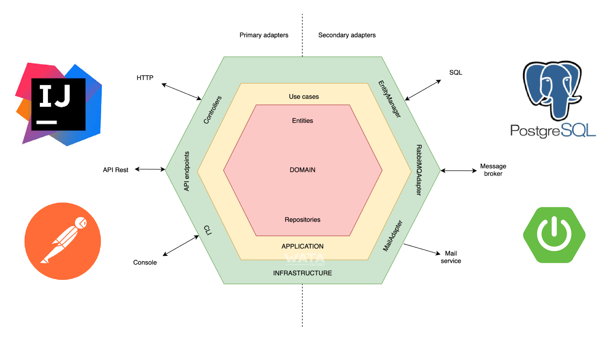
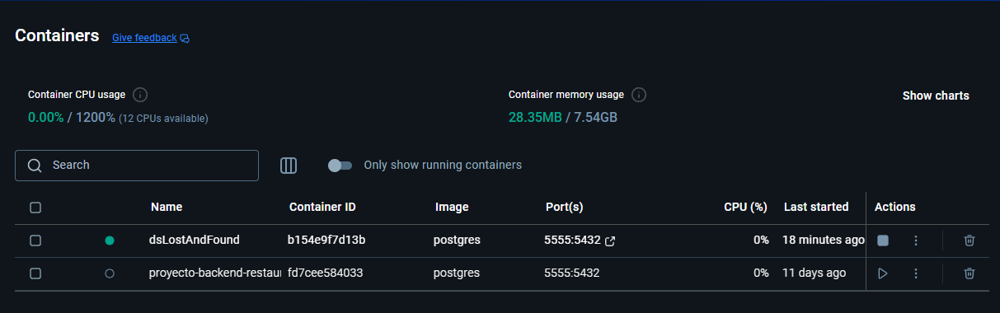
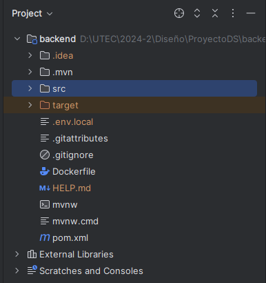
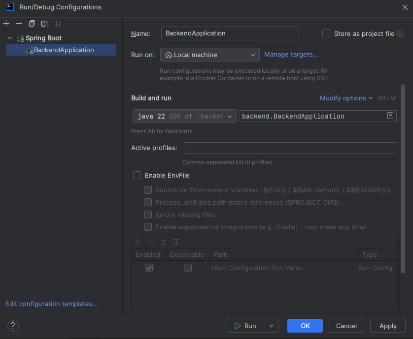
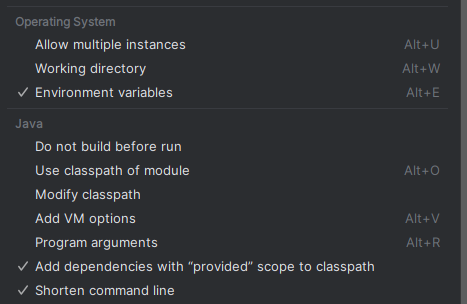
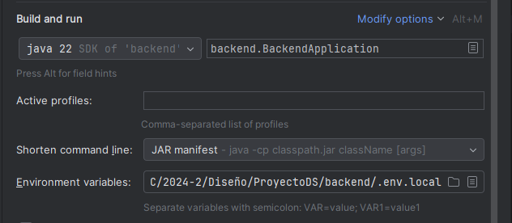
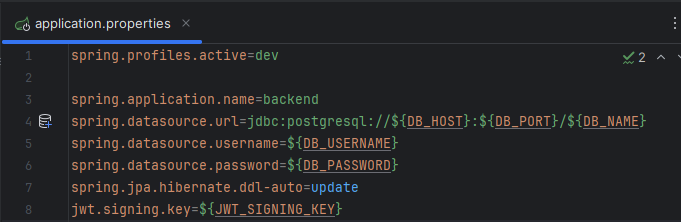
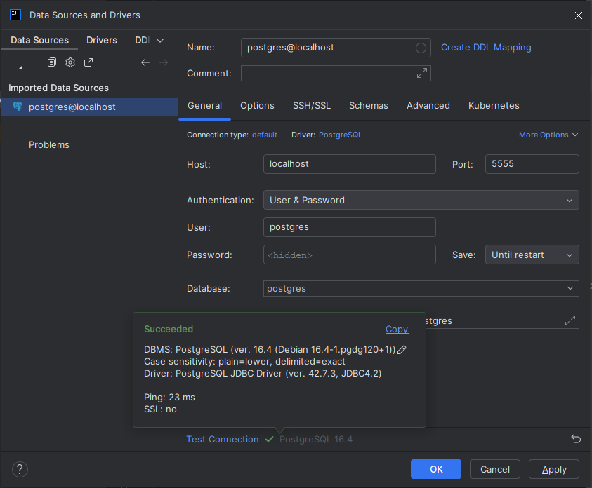
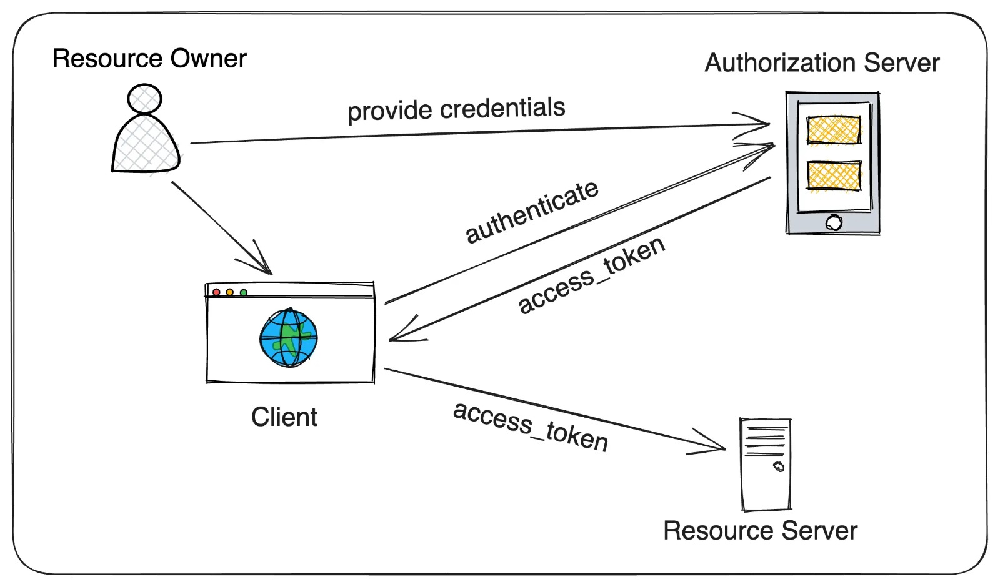

<div align="center">
  
</div>

<div align="center">
  <h1><b>Diseño de Software</b></h1>
  <h2>Manual del sistema</h2>
  <p><b>Profesor:</b> Jaime Farfán</p>
  <p><b>Alumno(s):</b></p>
  <p>Muñoz Paucar, Fernando Jose</p>
  <p>Ramírez Encinas, Oscar Gabriel</p>
  <p>Tinco Aliaga, César</p>
  <p><b>Fecha:</b> 06/12/2024</p>
  <p><b>Ciclo:</b> 2024-2</p>
</div>

---

## **1. Introducción**

### **Descripción del Sistema**
**Lost&Found** es una aplicación diseñada para que los estudiantes puedan reportar incidentes y objetos perdidos de manera rápida y eficiente. La plataforma centraliza la información de los reportes, permitiendo a los administradores dar seguimiento y coordinar la devolución de objetos encontrados. Los usuarios pueden detallar características del objeto o incidente, recibir notificaciones sobre el estado de su reporte y acceder a una base de datos organizada. Esto facilita la recuperación de pertenencias y mejora la eficiencia en la gestión de incidentes dentro de la institución.

### **Propósito y Objetivos**
1. **Centralización de Reportes:** Recopilar y organizar todos los reportes de incidentes y objetos perdidos en una plataforma única, facilitando su gestión y seguimiento.
2. **Eficiencia en la Recuperación:** Reducir el tiempo y esfuerzo necesario para devolver objetos encontrados a sus propietarios mediante un sistema claro y accesible.
3. **Accesibilidad para los Estudiantes:** Ofrecer una herramienta digital intuitiva y de fácil uso para que los estudiantes puedan registrar y consultar reportes en tiempo real.
4. **Mejora de la Comunicación:** Optimizar la interacción entre estudiantes y administradores, proporcionando actualizaciones y notificaciones sobre el estado de los reportes.
5. **Fomento de la Organización:** Crear un entorno más ordenado y confiable dentro de la institución al minimizar la pérdida de objetos y promover la responsabilidad compartida.

### **Alcance**
1. **Incluye:**
   - Registro de reportes: Permite a los estudiantes ingresar información sobre incidentes y objetos perdidos, como descripción, lugar y fecha.
   - Base de datos centralizada: Organiza los reportes para facilitar la búsqueda y el seguimiento por parte de los administradores.
   - Notificaciones y actualizaciones: Envía información a los estudiantes sobre el estado de sus reportes y objetos encontrados.
   - Coordinación de entregas: Facilita la logística para devolver objetos encontrados a sus propietarios legítimos.
   - Interfaz accesible: Brinda una plataforma intuitiva para su uso tanto por estudiantes como por administradores.
2. **No incluye:**
   - Seguimiento físico de objetos: No realiza rastreo en tiempo real de los objetos extraviados fuera del sistema.
   - Resolución automática: No garantiza la recuperación de todos los objetos reportados, ya que depende de que sean encontrados y entregados.
   - Soporte fuera de la institución: Solo cubre incidentes y objetos perdidos dentro de las instalaciones o áreas definidas por la institución.
   - Gestión de objetos de terceros: No se responsabiliza por objetos que no sean propiedad de estudiantes, como los pertenecientes a visitantes o personal externo.

---

## **2. Requisitos del Sistema**

### **Hardware**
- **Servidor Backend**:
  - Procesador: Intel i5 o superior.
  - RAM: 16 GB.
  - Almacenamiento: 100 GB SSD.
  - Conexión estable a internet con al menos 100 Mbps de velocidad de carga/descarga.
- **Dispositivos Cliente**:
  - Navegador moderno (Chrome, Firefox, Edge) en PC, laptop o smartphone.

### **Software**
- **Backend**: Java 11+, Spring Boot.
- **Frontend**: React.js, Node.js 14+.
- **Base de Datos**: PostgreSQL.
- **Herramientas Adicionales**: Docker Desktop, Git y GitHub, Visual Studio Code.
- **IDE Utilizado**: IntelliJ IDEA (para el desarrollo del backend con el framework Spring Boot).

---


## **3. Diagrama de Arquitectura del Sistema**

El sistema **Lost&Found** está compuesto por los siguientes elementos principales, organizados bajo el enfoque de **arquitectura hexagonal**:

### **Componentes Principales**
- **Frontend:**
  - Una interfaz web desarrollada en **React.js** que permite a los usuarios interactuar con el sistema mediante operaciones como registrar reportes y consultar el estado de objetos perdidos.
  - Se comunica con el backend a través de API REST utilizando adaptadores de entrada.

- **Backend:**
  - Un servicio desarrollado en **Spring Boot**, organizado en torno a un **núcleo de lógica de negocio**, que implementa las reglas y procesos principales del sistema.
  - Utiliza puertos para interactuar con adaptadores de entrada (controladores REST) y salida (repositorios y servicios externos).
  
- **Base de Datos:**
  - **PostgreSQL**, que almacena información estructurada sobre:
    - Usuarios.
    - Reportes de objetos perdidos.
    - Reportes de incidentes.
    - Historial de cada usuario (estudiante o empleado).

- **Adaptadores de Entrada:**
  - **Controladores REST:** Permiten recibir las solicitudes de los usuarios desde el frontend.

- **Adaptadores de Salida:**
  - **Repositorio de datos:** Interfaz para interactuar con la base de datos PostgreSQL.
  - **Servicio de notificaciones:** Conecta el backend con herramientas externas como correos electrónicos para enviar notificaciones sobre los reportes.

### **Arquitectura Hexagonal**

El sistema sigue el diseño de **arquitectura hexagonal**, organizándose en tres capas principales:

1. **Núcleo de Lógica de Negocio:**
   - Encargado de las operaciones principales, como la validación de reportes y la gestión de usuarios.
   - Es independiente de las tecnologías externas, asegurando que pueda ser probado fácilmente sin necesidad de bases de datos o interfaces externas.

2. **Puertos (Interfaces):**
   - **Puertos de Entrada:** Interfaz para aceptar comandos del frontend (por ejemplo, crear reportes o consultar estados).
   - **Puertos de Salida:** Interfaz para comunicarse con servicios externos, como la base de datos y las notificaciones.

3. **Adaptadores:**
   - **Adaptadores de Entrada:** Controladores REST que implementan los puertos de entrada y traducen solicitudes HTTP en comandos para el núcleo.
   - **Adaptadores de Salida:** Implementaciones específicas de los puertos de salida, como repositorios para interactuar con PostgreSQL o servicios de correo.
   

### **Diagrama de Arquitectura**




### **Descripción del Flujo**
1. El usuario interactúa con el **frontend**, realizando operaciones como registrar reportes.
2. El **frontend** envía solicitudes al **backend** a través de API REST.
3. Los **adaptadores de entrada** traducen estas solicitudes en comandos para el núcleo del sistema.
4. El **núcleo de lógica de negocio** procesa las solicitudes, verificando las reglas de negocio (por ejemplo, validar si el correo del usuario ya está registrado).
5. Si es necesario, el núcleo interactúa con los **adaptadores de salida**, que se encargan de consultar o actualizar datos en la base de datos, o enviar notificaciones a través de servicios externos.
6. Las respuestas se envían de vuelta al **frontend** para mostrarlas al usuario.

### **Beneficios del Enfoque Hexagonal**
- **Desacoplamiento:**
  - La lógica de negocio está completamente aislada de los detalles tecnológicos, como bases de datos o frameworks.
- **Flexibilidad:**
  - Cambiar el servicio de base de datos o proveedor de correos no afecta al núcleo del sistema.
- **Facilidad de prueba:**
  - El núcleo puede ser probado de manera independiente, sin necesidad de configurar bases de datos o servicios externos.
- **Escalabilidad:**
  - Es fácil extender el sistema añadiendo nuevos adaptadores o integraciones sin modificar la lógica central.

Este diseño permite a **Lost&Found** ser un sistema robusto, flexible y preparado para escalar a medida que crecen las necesidades de la aplicación.

---

## **4. Instalación**

### **Pasos de Instalación**

1. **Clonar el repositorio**:
   ```bash
   git clone https://github.com/FMunoz99/ProyectoDS.git
   ```

2. **Ejecutar el backend**:
   - Abre el proyecto en IntelliJ IDEA.
      ```bash
      idea .\backend\
      ```
   - Abre el terminal y ejecutar el comando:
     <br>
     ```bash
     docker run --name dsLostAndFound -e POSTGRES_PASSWORD=postgres -p 5555:5432 -d postgres
     ```
     
   - Abrir Docker Desktop y ejecutar el nuevo contenedor creado
     
     
   - Crear un archivo `.env.local` al mismo nivel del directorio /src
     <br>
     
     
   - Abrir el editor de configuraciones  
     
     
   - Ejecutar la modificación de opciones `Alt + M`  
     
     
   - Seleccionar `Environment variables` y `Shorten command line`  
     
     
   - Para las variables de entorno, ingresar la ruta del archivo dentro del directorio y para las líneas de comando, seleccionar la opción JAR
     
     
   - Configurar el archivo `application.properties` (/src/main/resources/) seleccionando el ícono de base de datos que aparece en la línea 4 para conectar la base de datos PostgreSQL.
     
     
   - Ingresar la contraseña `postgres` para verificar la conexión a la base de datos.
     
     
   - Iniciar el servidor con `Shift + F10`.

3. **Instalar dependencias del frontend**:
   - Iniciar Visual Studio Code
   ```bash
   cd Frontend
   npm install
   ```

5. **Ejecutar el frontend**:
   ```bash
   npm run dev
   ```
   Accede a la aplicación en [http://localhost:5173/](http://localhost:5173/).

---

## **5. Interfaz de Usuario**

### **Pantallas del Sistema**
- **Página de Bienvenida:** Permite a los usuarios iniciar sesión o registrarse en la plataforma.
- **Página Principal:** Muestra una lista de objetos reportados como perdidos y encontrados, además de opciones para crear nuevos reportes.
- **Detalles del Reporte:** Presenta información detallada sobre un objeto perdido o encontrado.
- **Panel de Empleado:** Herramientas de control y visualización de reportes para la actualización del estado de los reportes.
- **Panel de Administración:** Herramientas como un dashboard para monitorear la cantidad de reportes por día que se realizan.

### **Interacción**
- **Botones:** Crear reporte, marcar como `FINALIZADO`, notificar al propietario mediante correos electrónicos.
- **Formularios:** Registro de incidentes y descripción de objetos.
- **Menús:** Navegación entre reportes, usuarios y configuraciones.

---

## **6. Funcionalidades del Sistema**

1. **Registro de Reportes:**
   - Los estudiantes pueden crear reportes con detalles del objeto perdido, como descripción, lugar y fecha del incidente.

2. **Gestión de Reportes:**
   - Los administradores pueden filtrar y organizar los reportes en categorías (reportes `ACEPTADOS`, `NO ACEPTADOS`, `FINALIZADOS` y `NO FINALIZADOS`).

3. **Notificaciones:**
   - Los usuarios reciben actualizaciones por correo sobre el estado de su reporte.

4. **Coordinación de Devoluciones:**
   - Se agenda la devolución de un objeto perdido mediante los datos de contacto que brinda el estudiante al momento de rellenar el formulario.

---

## **7. Mantenimiento**

1. **Actualizaciones:**
   - Mantener las dependencias actualizadas regularmente.
   - Revisar la seguridad del sistema.

2. **Respaldo de Datos:**
   - Implementar respaldos automáticos para la base de datos.

3. **Resolución de Problemas:**
   - Revisar logs del sistema para detectar errores en tiempo de ejecución.

---


## **8. Seguridad**

1. **Autenticación y Autorización:**
   - Uso de **Spring Security** como framework principal para la gestión de autenticación y autorización.
   - **JSON Web Tokens (JWT):**
      - Se utilizan para garantizar sesiones seguras.
      - El token incluye información codificada sobre el usuario, como su rol, y es firmado con HMAC 256 para garantizar su integridad.
   - **Roles específicos:**
      - **Administrador:** Acceso completo al sistema, gestión de reportes y usuarios.
      - **Empleado:** Gestión de reportes, actualizaciones y coordinación.
      - **Estudiante:** Registro de reportes y consulta de estados.

2. **Buenas Prácticas:**
   - Uso de **contraseñas seguras**, almacenadas con algoritmos de hash.
   - Todas las conexiones entre cliente y servidor están protegidas mediante **HTTPS**.
   - Implementación de políticas de seguridad en endpoints para garantizar que solo los roles autorizados puedan acceder a los recursos específicos.

### **Uso de Spring Security**

**Spring Security** permite implementar mecanismos de seguridad de manera estructurada. Su integración incluye:

1. **Filtro de Autenticación:**
   - Valida los tokens JWT enviados por el cliente en cada solicitud.
   - Si el token es válido, extrae la información del usuario y la asigna al contexto de seguridad.
   
2. **Control de Acceso por Roles:**
   - Se define qué roles tienen permiso para acceder a los endpoints específicos.
   - Ejemplo:
     ```java
     @PreAuthorize("hasRole('ADMIN')")
     public ResponseEntity<?> manageReports() {
         return ResponseEntity.ok("Acceso permitido solo a administradores");
     }
     ```

3. **Configuración Centralizada:**
   - Las políticas de seguridad, como rutas públicas o protegidas, se configuran en una clase específica:
     ```java
     @Configuration
     public class SecurityConfig extends WebSecurityConfigurerAdapter {
         @Override
         protected void configure(HttpSecurity http) throws Exception {
             http
                 .csrf().disable()
                 .authorizeRequests()
                 .antMatchers("/public/**").permitAll()
                 .antMatchers("/admin/**").hasRole("ADMIN")
                 .anyRequest().authenticated()
                 .and()
                 .addFilter(new JwtAuthenticationFilter(authenticationManager()));
         }
     }
     ```

### **Diagrama de Funcionamiento**

A continuación, se presenta un diagrama que describe cómo funciona la autenticación con Spring Security y JWT:



---

### **Flujo de Trabajo de Seguridad:**
1. El usuario envía sus credenciales al endpoint de autenticación.
2. Spring Security valida las credenciales:
   - Si son correctas, se genera un JWT y se envía al cliente.
3. El cliente incluye el JWT en el encabezado de todas las solicitudes posteriores.
4. Spring Security intercepta las solicitudes:
   - Valida el JWT y extrae la información del usuario.
   - Verifica si el usuario tiene los permisos necesarios para acceder al recurso solicitado.
5. Si todo es válido, se permite el acceso; de lo contrario, se devuelve un error 403 (Forbidden).

Con esta configuración, el sistema garantiza una seguridad robusta y adaptable, protegiendo los datos y recursos del sistema **Lost&Found**.

---

## **9. Glosario**
- **Reporte:** Información detallada sobre un objeto perdido o incidente.
- **Administrador:** Usuario encargado de gestionar la base de datos de reportes.
- **Notificaciones por eventos asíncronos:** Mensajes enviados al correo del usuario para actualizar sobre el estado del reporte.

---

## **10. Política de Privacidad y Uso**

En el sistema **Lost&Found**, respetamos la privacidad de los usuarios y gestionamos los datos personales con responsabilidad. Aquí se detallan los aspectos más importantes sobre cómo protegemos y usamos la información:

### **Datos Recopilados**
- **Correo Electrónico:** Se utiliza para identificar a los usuarios y enviar notificaciones relacionadas con los reportes.
- **Contraseñas:** Se almacenan de manera segura utilizando algoritmos de hash (HMAC 256).
- **Reportes:** Información detallada sobre los objetos perdidos o encontrados, incluyendo descripciones, fechas y ubicaciones.

### **Uso de los Datos**
- Los correos electrónicos se usan para:
  - Evitar cuentas duplicadas mediante verificación.
  - Enviar actualizaciones sobre reportes.
- La información de los reportes se utiliza exclusivamente para gestionar incidentes dentro del sistema.

### **Medidas de Seguridad**
- Las contraseñas están protegidas mediante algoritmos de hash.
- Los correos electrónicos actualmente no están encriptados, pero se verifica si ya están registrados para evitar duplicados.

### **Limitaciones**
- **Responsabilidad del Usuario:** Asegúrese de no compartir sus credenciales con terceros.
- **Privacidad del Correo Electrónico:** Aunque el sistema evita registros duplicados, los correos no están encriptados. Se recomienda usar correos institucionales para mayor seguridad.

Para más información, contacte al equipo de soporte técnico.

---

## **11. Soporte Técnico**

- **Email:** 
  - fernando.munoz.p@utec.edu.pe
  - oscar.ramirez.e@utec.edu.pe
  - cesar.tinco@utec.edu.pe
- **Repositorio GitHub:** [ProyectoDS](https://github.com/FMunoz99/ProyectoDS.git)
