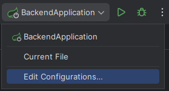

<div align="center">
  
</div>

<div align="center">
  <h1><b>Diseño de Software</b></h1>
  <h2>Manual del sistema</h2>
  <p><b>Profesor:</b> Jaime Farfán</p>
  <p><b>Alumno(s):</b></p>
  <p>Muñoz Paucar, Fernando Jose</p>
  <p>Ramírez Encinas, Oscar Gabriel</p>
  <p>Tinco Aliaga, César</p>
  <p><b>Fecha:</b> 06/12/2024</p>
  <p><b>Ciclo:</b> 2024-2</p>
</div>

---

## **1. Introducción**

### **Descripción del Sistema**
**Lost&Found** es una aplicación diseñada para que los estudiantes puedan reportar incidentes y objetos perdidos de manera rápida y eficiente. La plataforma centraliza la información de los reportes, permitiendo a los administradores dar seguimiento y coordinar la devolución de objetos encontrados. Los usuarios pueden detallar características del objeto o incidente, recibir notificaciones sobre el estado de su reporte y acceder a una base de datos organizada. Esto facilita la recuperación de pertenencias y mejora la eficiencia en la gestión de incidentes dentro de la institución.

### **Propósito y Objetivos**
1. **Centralización de Reportes:** Recopilar y organizar todos los reportes de incidentes y objetos perdidos en una plataforma única, facilitando su gestión y seguimiento.
2. **Eficiencia en la Recuperación:** Reducir el tiempo y esfuerzo necesario para devolver objetos encontrados a sus propietarios mediante un sistema claro y accesible.
3. **Accesibilidad para los Estudiantes:** Ofrecer una herramienta digital intuitiva y de fácil uso para que los estudiantes puedan registrar y consultar reportes en tiempo real.
4. **Mejora de la Comunicación:** Optimizar la interacción entre estudiantes y administradores, proporcionando actualizaciones y notificaciones sobre el estado de los reportes.
5. **Fomento de la Organización:** Crear un entorno más ordenado y confiable dentro de la institución al minimizar la pérdida de objetos y promover la responsabilidad compartida.

### **Alcance**
1. **Incluye:**
   - Registro de reportes: Permite a los estudiantes ingresar información sobre incidentes y objetos perdidos, como descripción, lugar y fecha.
   - Base de datos centralizada: Organiza los reportes para facilitar la búsqueda y el seguimiento por parte de los administradores.
   - Notificaciones y actualizaciones: Envía información a los estudiantes sobre el estado de sus reportes y objetos encontrados.
   - Coordinación de entregas: Facilita la logística para devolver objetos encontrados a sus propietarios legítimos.
   - Interfaz accesible: Brinda una plataforma intuitiva para su uso tanto por estudiantes como por administradores.
2. **No incluye:**
   - Seguimiento físico de objetos: No realiza rastreo en tiempo real de los objetos extraviados fuera del sistema.
   - Resolución automática: No garantiza la recuperación de todos los objetos reportados, ya que depende de que sean encontrados y entregados.
   - Soporte fuera de la institución: Solo cubre incidentes y objetos perdidos dentro de las instalaciones o áreas definidas por la institución.
   - Gestión de objetos de terceros: No se responsabiliza por objetos que no sean propiedad de estudiantes, como los pertenecientes a visitantes o personal externo.

---

## **2. Requisitos del Sistema**

### **Hardware**
- **Servidor Backend**:
  - Procesador: Intel i5 o superior.
  - RAM: 16 GB.
  - Almacenamiento: 100 GB SSD.
  - Conexión estable a internet con al menos 100 Mbps de velocidad de carga/descarga.
- **Dispositivos Cliente**:
  - Navegador moderno (Chrome, Firefox, Edge) en PC, laptop o smartphone.

### **Software**
- **Backend**: Java 11+, Spring Boot.
- **Frontend**: React.js, Node.js 14+.
- **Base de Datos**: PostgreSQL.
- **Herramientas Adicionales**: Docker Desktop, Git y GitHub, Visual Studio Code.
- **IDE Utilizado**: IntelliJ IDEA (para el desarrollo del backend con el framework Spring Boot).

---

## **3. Instalación**

### **Pasos de Instalación**

1. **Clonar el repositorio**:
   ```bash
   git clone https://github.com/FMunoz99/ProyectoDS.git
   ```

2. **Ejecutar el backend**:
   - Abre el proyecto en IntelliJ IDEA.
      ```bash
      idea .\backend\
      ```
   - Abre el terminal y ejecutar el comando: docker run --name dsLostAndFound -e POSTGRES_PASSWORD=postgres -p 5555:5432 -d postgres
   - 
   - Abrir Docker Desktop y ejecutar el nuevo contenedor creado
     
     
   - Crear un archivo `.env.local` al mismo nivel del directorio /src
     <br>
     
     
   - Abrir el editor de configuraciones  
     
     
   - Ejecutar la modificación de opciones `Alt + M`  
     
     
   - Seleccionar `Environment variables` y `Shorten command line`  
     
     
   - Para las variables de entorno, ingresar la ruta del archivo dentro del directorio y para las líneas de comando, seleccionar la opción JAR
     
     
   - Configurar el archivo `application.properties` (/src/main/resources/) seleccionando el ícono de base de datos que aparece en la línea 4 para conectar la base de datos PostgreSQL.
     
     
   - Ingresar la contraseña `postgres` para verificar la conexión a la base de datos.
     
     
   - Iniciar el servidor con `Shift + F10`.

3. **Instalar dependencias del frontend**:
   - Iniciar Visual Studio Code
   ```bash
   cd Frontend
   npm install
   ```

5. **Ejecutar el frontend**:
   ```bash
   npm run dev
   ```
   Accede a la aplicación en [http://localhost:5173/](http://localhost:5173/).

---

## **4. Interfaz de Usuario**

### **Pantallas del Sistema**
- **Página de Bienvenida:** Permite a los usuarios iniciar sesión o registrarse en la plataforma.
- **Página Principal:** Muestra una lista de objetos reportados como perdidos y encontrados, además de opciones para crear nuevos reportes.
- **Detalles del Reporte:** Presenta información detallada sobre un objeto perdido o encontrado.
- **Panel de Empleado:** Herramientas de control y visualización de reportes para la actualización del estado de los reportes.
- **Panel de Administración:** Herramientas como un dashboard para monitorear la cantidad de reportes por día que se realizan.

### **Interacción**
- **Botones:** Crear reporte, marcar como `FINALIZADO`, notificar al propietario mediante correos electrónicos.
- **Formularios:** Registro de incidentes y descripción de objetos.
- **Menús:** Navegación entre reportes, usuarios y configuraciones.

---

## **5. Funcionalidades del Sistema**

1. **Registro de Reportes:**
   - Los estudiantes pueden crear reportes con detalles del objeto perdido, como descripción, lugar y fecha del incidente.

2. **Gestión de Reportes:**
   - Los administradores pueden filtrar y organizar los reportes en categorías (reportes `ACEPTADOS`, `NO ACEPTADOS`, `FINALIZADOS` y `NO FINALIZADOS`).

3. **Notificaciones:**
   - Los usuarios reciben actualizaciones por correo sobre el estado de su reporte.

4. **Coordinación de Devoluciones:**
   - Se agenda la devolución de un objeto perdido mediante los datos de contacto que brinda el estudiante al momento de rellenar el formulario.

---

## **6. Mantenimiento**

1. **Actualizaciones:**
   - Mantener las dependencias actualizadas regularmente.
   - Revisar la seguridad del sistema.

2. **Respaldo de Datos:**
   - Implementar respaldos automáticos para la base de datos.

3. **Resolución de Problemas:**
   - Revisar logs del sistema para detectar errores en tiempo de ejecución.

---

## **7. Seguridad**

1. **Autenticación y Autorización:**
   - Uso de JWT Web Token para sesiones seguras (hasheo de contraseñas con HMAC 256).
   - Roles específicos (administrador, empleado y estudiante).

2. **Buenas Prácticas:**
   - Contraseñas seguras y actualizadas.
   - HTTPS para todas las conexiones.

---

## **8. Glosario**
- **Reporte:** Información detallada sobre un objeto perdido o incidente.
- **Administrador:** Usuario encargado de gestionar la base de datos de reportes.
- **Notificaciones por eventos asíncronos:** Mensajes enviados al correo del usuario para actualizar sobre el estado del reporte.

---

## **9. Soporte Técnico**

- **Email:** 
  - fernando.munoz.p@utec.edu.pe
  - oscar.ramirez.e@utec.edu.pe
  - cesar.tinco@utec.edu.pe
- **Repositorio GitHub:** [ProyectoDS](https://github.com/FMunoz99/ProyectoDS.git)
